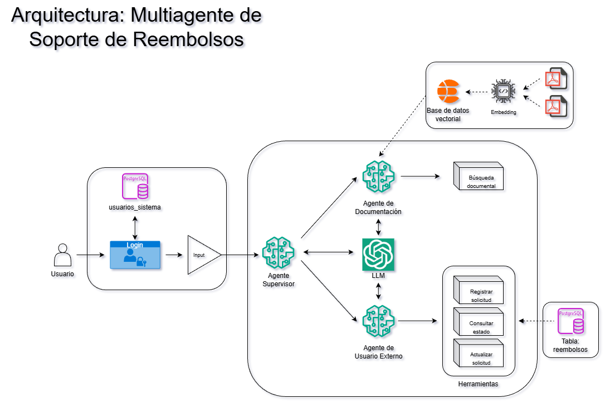

# 🩺 Multiagente de Solicitudes de Reembolsos Médicos
Este proyecto implementa un multi-agente para la gestión de solicitudes de reembolsos médicos con **LangGraph** y **Streamlit** que integra **PostgreSQL (GCP)** para CRUD y **Elasticsearch (RAG)** para documentación, asimismo cuenta con un **control de acceso basado en roles (RBAC)** que garantiza que las herramientas y datos se usen según los permisos del tipo de usuario.

## 🚀 Requisitos y Configuración Inicial

Para ejecutar la aplicación localmente, necesitas tener **Python 3.10 o superior** y credenciales de OpenAI (para el uso del LLM), Langchain (para el tracing del agente) y Elasticsearch (para el RAG).

### - Instalación de dependencias

Ejecuta el siguiente comando para instalar todas las librerías necesarias (LangChain, Streamlit, Elasticsearch, SQLAlchemy, entre otros):

```bash
pip install -r requirements.txt
```

### - Configuración de archivos necesarios

Para ejecutar el código necesitas los siguientes archivos en las ubicaciones específicas:

| Archivo | Ubicación | Columnas Clave |
| :--- | :--- | :--- |
| **`openai.txt`** | Raíz | Almacena la credencial (API) de **OpenAI**. |
| **`langchain.txt`** | Raíz | Almacena la credencial (API) de **Langchain**. |
| **`elasticstore.txt`** | Raíz | Almacena la credencial/contraseña del servidor de **Elasticsearch**. |
| **`postgresql.txt`** | Raíz | Almacena la credencial (URI) de **PostgreSQL (GCP)**. |

---

## ⚙️ Instrucciones de Ejecución Local

Para lanzar la interfaz web de Streamlit, utiliza el siguiente comando desde el directorio principal:

```bash
streamlit run app.py
```
## 🧠 Arquitectura del agente


